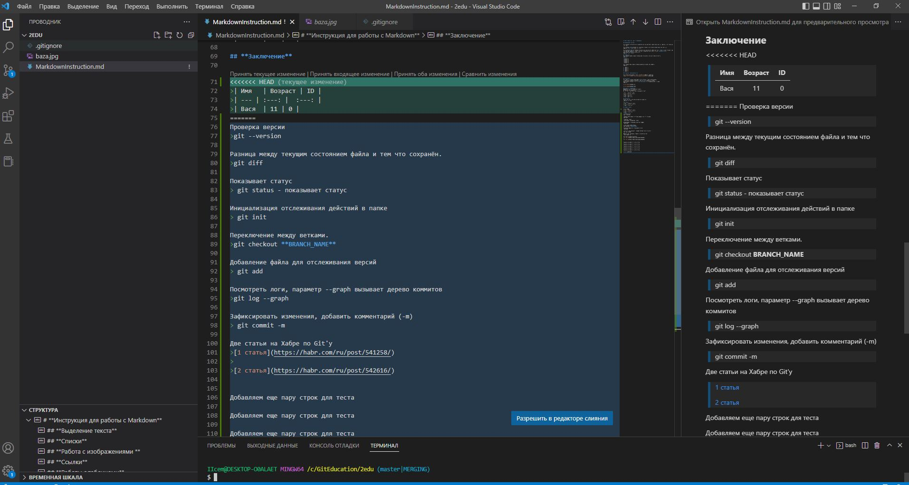
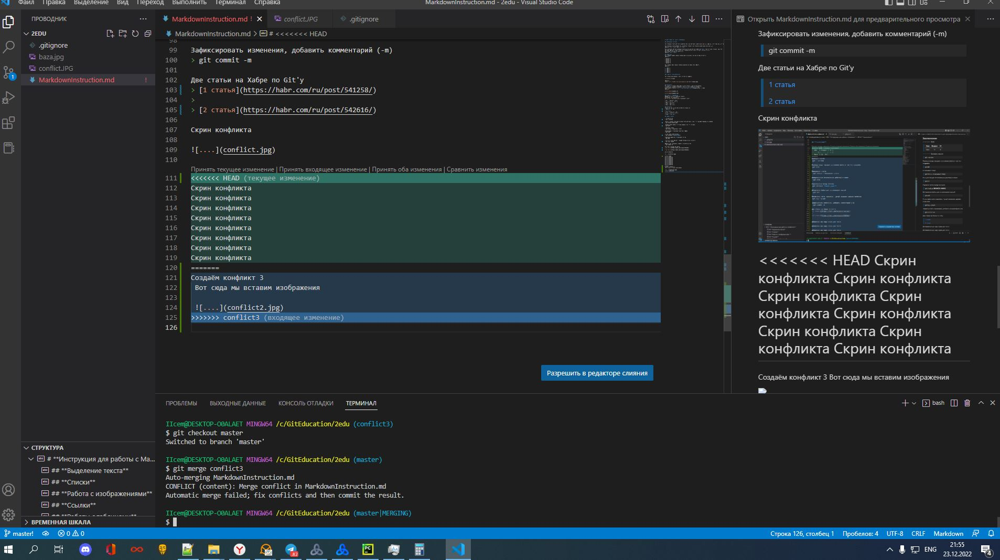
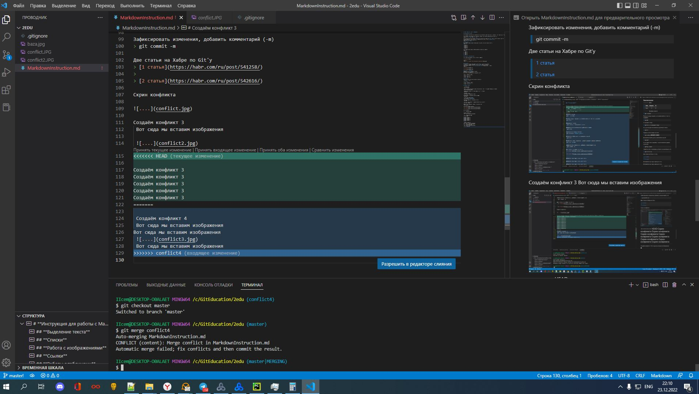

# **Инструкция для работы с Markdown**

## **Выделение текста**

Для выделения текста курсивом необходимо по краям поставить зёздочки(*) или (_). Например, *вот так* или _вот так_

Для выделения текста полужирным, необходимо выделить его двойными звездочками (**) или (__).
Например, **вот так**. или __вот так__

Альтернативные способы выделения текста жирным или курсивом нужны для того, чтобы мы могли совмещать оба этих способа. Например, _текст может быть выделен курсивом и при этом быть **полужирным**_.
Или выделить при помощи (***),(___)
Например ***вот так***

## **Списки**
Для создания ненумерованного списка надо исользовать (*) или (+) перед текстом.
Например:

* Элемент 1
* Элемент 2
* Элемент 3
+ Элемент 4
+ Элемент 5

Для создания нумерованного списка необходимо пронумеровать пункты. 
Например:

1. Пункт 1
2. Пункт 2
3. Пункт 3
4. Пункт 4
5. Пункт 5

## **Работа с изображениями**

Для вставки изображений в текст, достаточно написать 

>! [текст] (ссылка)

Например: 

## **Ссылки**
Для работы с ссылками используется метод схожий с работой изображений, 
в квадратные скобки[] вставляется текст а в () вставляется ссылка.
Единственное отличие в том что **не используется** восклицательный( ! ) знак
Например:

[Поиск Яндекс](yandex.ru)

[Поиск Google](google.com)

## **Работы с таблицами**
Таблицы оформляются следующим образом.
Выравнивать не обязательно.
Во второй строке двоеточими выравнивается текст

| Имя   | Возраст | ID |
| --- | :---: |  :---: |
| Вася  | 11 | 0 |
| Петя  | 15 | 1 |
| Димя  | 18  | 2 |

## **Цитаты**
Цитаты оформляются при помощи угловой скобки (>)
> Например вот так
>
> **и так**
>| Имя   | Возраст | ID |
>| --- | :---: |  :---: |
>| Вася  | 11 | 0 |

## **Команды для итоговой работы**

Синхронизация изменения из ветки master Удалённого репозитория (GitHub) на локальный ПК.
> git pull  
>
> git pull ***URL*** **master**  -  master как имя скачиваемой ветки

Загружаем с локального хранилища в Удалённый репозиторий (GitHub)
>git push
>
>git push -u origin iicemaster
>
>**Origin** - это сокращенное имя удаленного репозитория, из которого изначально был клонирован проект. Точнее, он используется вместо URL - адреса исходного репозитория-и тем самым значительно упрощает ссылки.
>
>**iicemaster** - Имя загружаемой ветки
>
>**При помощи ключа -u** (полный вариант **--set-upstream**) в удалённом репозитории создаётся (если ещё не существует) ветка, соответствующая локальной и связываете их. В будущем при отправлении изменений по той же самой ветке можно использовать сокращенную команду - **git push**

Полезные ссылки
> **[Работа с удаленным репозиторием, команды и ключи]**(https://smartiqa.ru/courses/git/lesson-6)
>
> **[Все уроки по Git]**(https://smartiqa.ru/courses/git)

## **Заключение**

Проверка версии
> git --version  

Инициализация отслеживания действий в папке 
> git init

Добавление файла для отслеживания версий 
> git add 
  
Зафиксировать изменения, добавить комментарий (-m) 
> git commit -m  
>
> git commit -am "тест" (-am = add + message, объединяются две команды. git add и git commit -m)

Показывает статус
> git status - показывает статус

Работа с ветками. Если перед именем ветки поставить (-d) - то она будет удалена. d = Delete
> git branch branch_name
 
Переключение между ветками.
> git checkout **BRANCH_NAME**
> 
> git checkout -b **BRANCH_NAME** сразу создаёт новую ветку

Разница между текущим состоянием файла и тем что сохранён. 
> git diff  
 
Слить ветки
>git merge
>
>git merge --abort (отмена слияния)

Бэкап ветки
>git reset --hard **commit** (example: git reset --hard b2453ea)

Посмотреть логи, параметр --graph вызывает дерево коммитов
> git log --graph 

Две статьи на Хабре по Git'у
> [1 статья](https://habr.com/ru/post/541258/)
>
> [2 статья](https://habr.com/ru/post/542616/)

Скрин конфликта

Создаём конфликт 3
 Вот сюда мы вставим изображения

 
 
 Создаём конфликт 4

 

